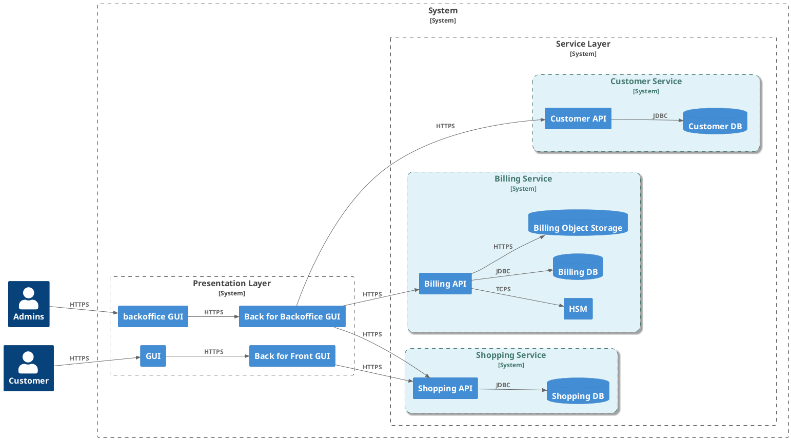
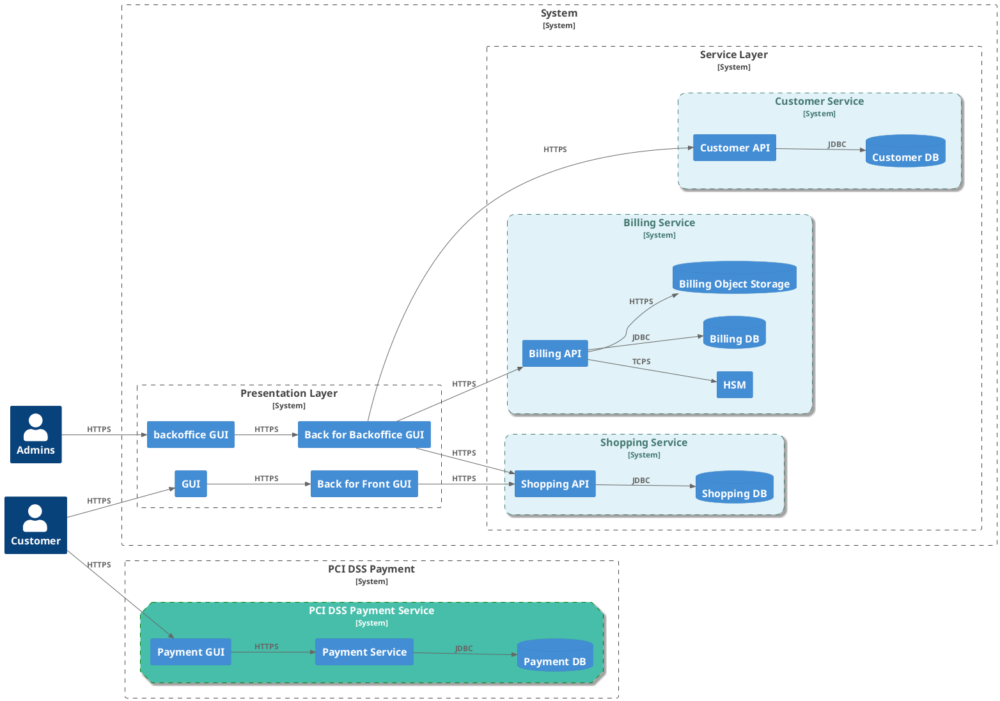


_Photo by <a href="https://unsplash.com/@joelfilip?utm_source=unsplash&utm_medium=referral&utm_content=creditCopyText">Joel Filipe</a> on <a href="https://unsplash.com/photos/low-angle-photo-of-30-st-mary-axe-VuwAfoHpxgs?utm_source=unsplash&utm_medium=referral&utm_content=creditCopyText">Unsplash</a>_
      
      

For a couple of years, I have been regularly working on designing and implementing cloud-native landing zones on multiple cloud providers at once. 
When I started designing such platforms, I was somewhat wary. 
The theory was slightly attractive: I could cherry-pick the best services from each cloud provider to build the ultimate architecture. 
Nevertheless, I held some reservations about operational concerns: complexity, costs, observability, alerting, and the like.

Let's be honest: beyond the marketing slides, cloud providers are anything but interchangeable. Furthermore, the operational burden of managing multiple clouds is not linear. It may lead you into a labyrinth of technical complexities where network latency, fragmented data, and incompatible APIs threaten both your SLA and your peace of mind.

This article is the first part of a series that aims to share my experience and lessons learned from the trenches of [Multi-Cloud](https://azure.microsoft.com/en-us/resources/cloud-computing-dictionary/what-is-multi-cloud). 
It will cover the "Why" and "What" of Multi-Cloud, exploring the motivations behind adopting such a strategy and defining what Multi-Cloud truly entails.
Subsequent parts will delve into the "How," providing practical insights and strategies for successful Multi-Cloud implementations.

## The Why

Why go through this pain? 
Everyone has their reasons—usually driven by a mix of corporate strategy and technical requirements. 
Here’s my take on the main drivers I’ve encountered.

### Risk mitigation and business continuity

This is often cited as a primary driver for Multi-Cloud adoption. The idea is to avoid a single point of failure by distributing your workloads across multiple cloud providers. In the event of an outage or disaster with one provider, your services can theoretically failover to another, ensuring business continuity.

That was the easy part.
In practice, achieving true business continuity across multiple clouds is far more complex than simply replicating workloads. This is because it requires a deep understanding of each cloud provider's infrastructure, services, and APIs, as well as the ability to manage and orchestrate workloads across disparate environments. 

Beyond maintaining different tools and setups (e.g., two Terraform setups), you will also need to consider data replication strategies, network connectivity, and security implications across multiple environments.

Consequently, in my view, this use case is primarily reserved for highly sensitive workloads. For financial institutions or public services subject to military or governmental regulations (such as the [OIV in France](https://www.sgdsn.gouv.fr/files/files/Nos_missions/plaquette-saiv.pdf)), a multi-region setup may be "enough" to comply with these requirements and prevent outages.

Nevertheless, at a corporate level, Multi-Cloud hosting for different platforms can be beneficial. It may offer the ability to choose the right hosting provider for every platform. In addition, it may help you to _easily_ switch from one provider to another if needed.

### Cost "optimization"

For this topic, there are basically two situations to consider: 
- Building a Multi-Cloud landing zone from scratch 
- Integrating two existing solutions without rebuilding one of them in another cloud provider's landing zone

For the first topic, we will definitely lose money. 
Building a Multi-Cloud setup from the ground up is a technical solution to mitigate and prevent high-impact risks when there's no other possible way.
Furthermore, it brings additional costs which may inflate the bill: staying current with two different technologies, maintaining and operating two different setups, networking...

For the latter, it's a whole new ball game.
Building or migrating an existing service already available on another cloud provider could be tricky and highly expensive, even if you built it on top of standards such as Kubernetes. Nevertheless, would you really save money in this case? Depending on the interactions between the different parts of the platform (from one cloud provider to another), you may, at the end of the day, face prohibitive additional costs. 

The only way to determine if it is acceptable is to analyze the different workflows, pinpoint the implied transactions, and estimate the corresponding costs. 
I usually start by evaluating network costs. While it's not the only cost center impacted by a Multi-Cloud topology, it's a good indicator for forecasting cost increases though.

For instance, imagine we have this workflow for one use case involving two different cloud providers: 

sequenceDiagram
    participant Client
    participant API_Cloud_Provider_#1
    participant API_Cloud_Provider_#2
    Client->>API_Cloud_Provider_#1: Call API /my_feature
    API_Cloud_Provider_#1->>API_Cloud_Provider_#2: Call API /my_sub_feature
    Note right of API_Cloud_Provider_#2: Inter cloud provider transaction through Internet or VPN (Egress fees)


Obviously, internet transactions are cheaper than VPN or [InterConnect solutions](https://docs.cloud.google.com/network-connectivity/docs/interconnect/concepts/overview). However, even though they go through the Internet, they still incur additional costs.

Imagine you have the following requirements:

- Number of transactions for ``/my_feature`` per second: 100 TPS
- Estimated payload size: 5KB

This results in a monthly bandwidth of roughly 43 GB.
On GCP, it would cost approximately $6 if your transactions go through the Internet. In this case, it is definitely worth it. However, if your transactions require an Interconnect connection, it will cost around $6,800!

To sum up, it is crucial to regularly review the main workflows and NFRs (Non-Functional Requirements) to estimate the implied additional costs of your technical choices. Why? Because, initially, you will likely work with significant uncertainty that will only decrease over time (e.g., after setting up your platform in the development environment).

### [Vendor Lock-in](https://www.cloudflare.com/en-gb/learning/cloud/what-is-vendor-lock-in/) avoidance

Avoiding vendor lock-in is the holy grail of IT managers. It sounds great on paper, but in practice, if you stick strictly to the "lowest common denominator" to stay portable, you’re missing out on 80% of what makes cloud worth the money. 
My advice? 
Be pragmatic. 
Don't self-restrict; just calculate the "exit price" before you commit.

For instance, let's look at an e-commerce microservices platform:

Even though we deploy managed services for databases or API gateways, we can assume we won't be totally locked into these components. They rely on either standards or open-source solutions. It won't be free, but the migration costs will be _acceptable_.

However, there's one component in this architecture worth taking the time to look into: the [HSM](https://en.wikipedia.org/wiki/Hardware_security_module). Usually, it's fully proprietary, and you would be definitively locked in once you start rolling out your service in production.

In this use case, we can imagine two solutions:
1. Assume we will be fully locked in 
2. Providing a different HSM module (on-premise or from another provider) or using cryptographic mechanisms (e.g., DEK/KEK) to mitigate the risks.

That's just a sneak peek into why, in the long term, architecting a Multi-Cloud setup might secure your technical architectural choices. As discussed in the Risk Mitigation chapter, it might help avoid being locked in with a vendor.

### Best-of-Breed services

When you design a platform you are often tempted to choose the best product or solution for every use case. It might also help you avoid reinventing the wheel if you already have existing off-the-shelf solutions.

We can imagine a platform split into two parts:
1. The first part for the transactional processes : [AWS EC2 VMs](https://aws.amazon.com/ec2/) and or [EKS Kubernetes cluster](https://aws.amazon.com/eks/)
2. The second part for the Business Intelligence workloads run on top of [GCP BigQuery](https://cloud.google.com/bigquery?hl=en). 

For the latter, we can imagine we already have scripts, dashboards which could be reused.

Usually it's one of the most important key factor to switch to this kind of architecture. It may help streamline your delivery by promoting reusability. 

Nevertheless, it's crucial to check if it's relevant regarding the platform requirements and expectations. 

### Regulatory compliance and data residency

Last, but not the least, what about all regulation and compliance?

Isolating some of your workloads into one cloud provider and host the least critical workloads to another one may be a strategy to assess. 
In my opinion, it's a strategy that would be studied at a global level because the scope of this implementation will affect the entire company's IT landscape. It may help streamline the setup and the compliancy assessment of sensitive workloads (e.g., [PCI DSS](https://www.pcisecuritystandards.org/)).

For instance, if we stick to the same e-commerce use case, we may consider splitting our workload into two different ones hosted on different cloud providers.

In this way, we would be able to streamline the setup, review, and by extension, the entire SDLC for specific sensitive workloads.

## What

In the first part, we explored why we would be interested in embracing such an architecture. Now, let's see what a Multi-Cloud architecture looks like in real life.

### What is _NOT_ a Multi-Cloud architecture

Before embracing this architectural pattern, it's mandatory to weigh the pros and cons and understand:

* It's neither a silver bullet nor a magical recipe 
* It's not free of charge and incurs additional technical and human costs.

Now, we have exposed the basics, we can go further 😀.

### Beyond the buzzword

Before diving into the "how", we need to align on what Multi-Cloud actually means in a production environment. It’s not just about having an AWS account for one team and a GCP project for another. It is a deliberate architectural choice to distribute a single platform or a set of interconnected services across multiple public cloud providers.

In my experience, Multi-Cloud usually takes one of three forms:

1. **Functional Split (Best-of-Breed):** Distributing components based on provider strengths (e.g., App on AWS, Analytics on BigQuery).
2. **Redundancy ([BCP](https://entreprendre.service-public.gouv.fr/actualites/A18429?lang=en)):** Running the same workload on two clouds for extreme resilience.
3. **Portability (Cloud Agnostic):** Using abstraction layers like Kubernetes to remain provider-agnostic, keeping in mind the constraints I mentioned earlier.

This architecture relies on three main pillars that I will dig into in the next parts of this series: 

* **Connectivity:** VPN, Interconnect,...
* **Data Portability:** Correlating data stored in the different platforms
* **Identity (IAM):** Identity federation (or not)? Role mapping based on OpenID Connect
* **Observability:** Bringing together logs and metrics to get a consolidated 360° overview.

### What about human costs?

At this stage of the article, you likely understand that choosing a Multi-Cloud strategy will eventually require your teams to gain and maintain expertise in the technologies of two (or more) cloud providers.
These costs will stem from the time spent training and upskilling.
Additionally, further costs will come from the maintenance of tooling and procedures: Infrastructure as Code, backups, network VPNs, and the supply chain.
This is often underestimated at the beginning but can eventually inflate the bill.

Then, this strategy requires developing commercial partnerships with different cloud providers. This can be time-consuming.

Furthermore, it will require formalizing your strategy through, for example, a decision tree.
In my view, although it may be time-consuming to draft and validate, this step is mandatory.
It will offer clarity to your teams and help them avoid struggling to choose the right provider for each use case.

### The sad reality: End users don't care

Now let's address this matter from an end-user's perspective. Normally, your customers won't care whether you set up your platform on one or two cloud providers. 
They just want it to work.
One of the main challenges, which I will present in the next article, will be to provide a unified view of your platform. For instance, how to provide insightful, unified KPIs (e.g., SLAs) or consolidated observability from end to end.
From a customer perspective, having, for instance, two log or KPI dashboards would be awful.

## Conclusion

 To cut a long story short: Multi-cloud isn't a silver bullet.
 While it offers unparalleled resilience and flexibility, it also demands a high level of technical maturity and a clear understanding of operational costs. 
One of the main challenges is providing a cohesive view to end users, whether for the services provided or for observability purposes.

We can then compare a Multi-Cloud Architecture with a "Single-Cloud" one through these [architectural characteristics](https://www.oreilly.com/library/view/building-evolutionary-architectures/9781491986356/ch02.html) :


The more a function has stars, the more is convenient or better.

This evaluation is personal. You may be against some of my conclusions.



|Architecture characteristic   |   "Single" Cloud Architecture | Multi-Cloud Architecture|
|---|---|---| 
|Partitioning type   | Domain & technical  | Domain & technical|
|Number of quanta [^1]  |  1 to many | many |
|Deployability   | ⭐⭐⭐⭐⭐ | ⭐⭐⭐⭐ |
|Elasticity   | ⭐⭐⭐⭐ | ⭐⭐⭐⭐⭐ |
|Evolutionary   | ⭐⭐⭐⭐ | ⭐⭐⭐⭐ |
|Fault Tolerance   | ⭐⭐⭐⭐ | ⭐⭐⭐⭐⭐ |
|Modularity   | ⭐⭐⭐⭐  | ⭐⭐⭐⭐|
|Overall cost   | ⭐⭐⭐| ⭐|
|Performance   | ⭐⭐⭐⭐⭐| ⭐⭐⭐⭐ |
|Reliability   | ⭐⭐⭐⭐| ⭐⭐⭐⭐⭐ |
|Scalability   | ⭐⭐⭐⭐⭐| ⭐⭐⭐⭐⭐ |
|Simplicity   | ⭐⭐⭐⭐⭐| ⭐⭐|
|Testability   | ⭐⭐⭐  | ⭐⭐⭐|

In the next part of this series, we will dive into the **"How"**: the actual design and implementation details, the networking pitfalls, and how to provide a cohesive view to your customers from end to end. Stay tuned!

[^1]: ~ Number of loose-coupled artifacts