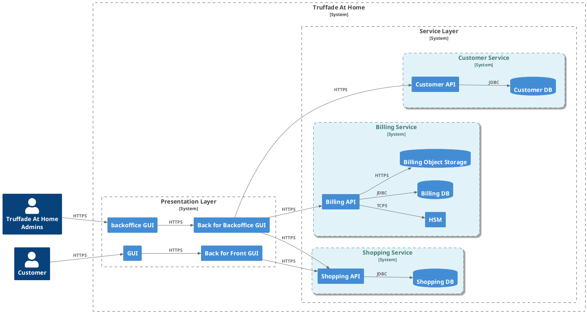


_Photo by <a href="https://unsplash.com/@joelfilip?utm_source=unsplash&utm_medium=referral&utm_content=creditCopyText">Joel Filipe</a> on <a href="https://unsplash.com/photos/low-angle-photo-of-30-st-mary-axe-VuwAfoHpxgs?utm_source=unsplash&utm_medium=referral&utm_content=creditCopyText">Unsplash</a>_
      
      

For a couple of years, I have been regularly working on designing and implementing cloud-native landing zones on multiple cloud providers at once. 
When I started desigining such a platforms, I was a little bit scared. 
The theory was slighlty attractive: I could cherry pick the best services from each cloud provider to build the ultimate architecture. 
Nevertheless, I had expressed some reservations about operational worries : complexity, costs, observability, alerting and such like.

Why? The sad reality is actually that, beyond the commercial speeches, cloud platforms capabilities are not equals and they are not interchangeable. Then, the operational burden of managing multiple clouds is not linear. It may take you into a labyrinth of technical complexities where network latency, fragmented data and incompatible API threnten both your SLA and your peace of mind.

This article is the first part of a series that aims to share my experience and lessons learned from the trenches of multi-cloud. It will cover the "Why" and "What" of multi-cloud, exploring the motivations behind adopting such a strategy and defining what multi-cloud truly entails. Subsequent parts will delve into the "How," providing practical insights and strategies for successful multi-cloud implementations.

## Why

There are many reasons you may adopt a multi-cloud strategy. Whether you are drafting a hosting strategy at a global level of your company or when you are designing a new platform, multi-cloud can be a compelling option. Let's explore some of the most common drivers. For each of them, I will provide my **personal**  insights:

### Risk mitigation and business continuity

This is often cited as a primary driver for multi-cloud adoption. The idea is to avoid a single point of failure by distributing your workloads across multiple cloud providers. In the event of an outage or disaster with one provider, your services can theoretically failover to another, ensuring business continuity.

That was the easy part.
Behind the curtain, you will find that achieving true business continuity across multiple clouds is far more complex than simply replicating workloads. This is because it requires a deep understanding of each cloud provider's infrastructure, services, and APIs, as well as the ability to manage and orchestrate workloads across disparate environments. 

Beyond maintaining different tools and setups (e.g., 2 Terraform setups), you will also need to consider data replication strategies, network connectivity, and security implications across multiple environments.

Then, in my view, this use case is strictly reserved to highly sensitive workloads. Usually for financial institutions or public services which are providing services which are subject to military or governmental regulations such as the [OIV in France](https://www.sgdsn.gouv.fr/files/files/Nos_missions/plaquette-saiv.pdf), providing a multiple-region setup may be "enough" and might comply with these requirements and prevent any outage.

Nevertheless, at a company level, having a multi-cloud hosting for different platforms may be a good thing. It may offer the ability to choose the right hosting provider for every platform. In addition, it may help you to _easily_ switch from one provider to another if needed.

### Cost "optimization"

For this topic, there are basically two situations to consider: 
- Building a multi-cloud landing zone from scratch 
- Integrating two existing solutions without rebuilding one of them in another cloud provider's landing zone

For the first topic, we will definitely lose money. 
Building a multi-cloud setup from the ground up is a technical solution to mitigate and prevent high-impact risks when there's no other possible way.
Furthermore, it brings additional costs which may inflate the bill: staying current with two different technologies, maintaining and operating two different setups, networking...

For the latter, it's a whole new ball game.
Building or migrating an existing service already available on another cloud provider could be tricky and highly expensive, even if you built it on top of standards such as Kubernetes. Nevertheless, would you really save money in this case? Depending on the interactions between the different parts of the platform (from one cloud provider to another), you may, at the end of the day, face prohibitive additional costs. The only way to determine if it is acceptable is to analyze the different workflows, pinpoint the implied transactions, and estimate the corresponding costs. 
I'm used to start evaluating network costs. It's not the only cost center impacted by a multi-cloud topoology. Nevertheless, it's a good smell to outlook the cost increase.

For instance, imagine we have this workflow for one use case involving two different cloud providers: 

sequenceDiagram
    participant Client
    participant API_Cloud_Provider_#1
    participant API_Cloud_Provider_#2
    Client->>API_Cloud_Provider_#1: Call API /my_feature
    API_Cloud_Provider_#1->>API_Cloud_Provider_#2: Call API /my_sub_feature
    Note right of API_Cloud_Provider_#2: Inter cloud provider transaction through Internet or VPN


Obviously, internet transactions are cheaper than VPN or [InterConnect solutions](https://docs.cloud.google.com/network-connectivity/docs/interconnect/concepts/overview). However, even though they go through the Internet, they still incur additional costs.

Imagine you have the following requirements:

- Number of transactions for ``/my_feature`` per second: 100 TPS
- Estimated payload size: 5KB

It results to a monthly bandwidth of roughly 43GB.
On GCP, it would cost approximately $6 if your transactions go through the Internet. In this case, it is definitely worth it. However, if your transactions require a VPN, it will cost around $6,800!

To sum up, it is crucial to regularly review the main workflows and NFRs (Non-Functional Requirements) to estimate the implied additional costs of your technical choices. Why? Because, initially, you will likely work with significant uncertainty that will only decrease over time (e.g., after setting up your platform in the development environment).

### 3. Vendor Lock-in avoidance

From an organizational perspective, this makes sense as it prevents dependency on a single provider. That is the theory. In practice, if you only stick to standards and avoid provider-specific features, you miss out on many valuable functionalities. 

I believe that instead of self-restricting, one should take a more pragmatic approach and evaluate the impact of a potential migration: is it impossible? If not, at what cost?

For instance, let's dig into a ecommerce microservices platform :

Even though we deploy managed services for databases or API gateway, we may guess we won't be totally locked by these components. They rely either on standards or open source solutions. It won't be free, but the migration costs will be acceptables.
However, there's one component in this architecture it's worth taking time to look into it : the [HSM](https://en.wikipedia.org/wiki/Hardware_security_module). Usually it's fully proprietary and you would be definitively locked once you started rolling out your service on production.

That's why, in some cases, architecturing a multi-cloud setup might secure your architectural technical choices in the long term.

### 4. Best-of-Breed services

Usually when I work on multi-cloud platforms, the main reason behind this choice is either getting the best services to fit the user needs or reusing existing ones avoiding reinventing the wheel.

We can imagine, a platform splitted in two parts:
1. The first part for the transactional processes : AWS EC2 VMs, EKS Kubernetes cluster
2. The second part for the Business Inteligence workloads run on top of GCP BigQuery.

### 6. Regulatory compliance and data residency

organization / partnersship / compliance

different products

## What

configuration multi cloud dans le cadre d'une plateforme 

plusieurs acteurs et solutions sont envisagées et on va évaluer la pertinence du multi cloud

L'utilisateur veut un service et non plusieurs plateformes !

## Conclusion

